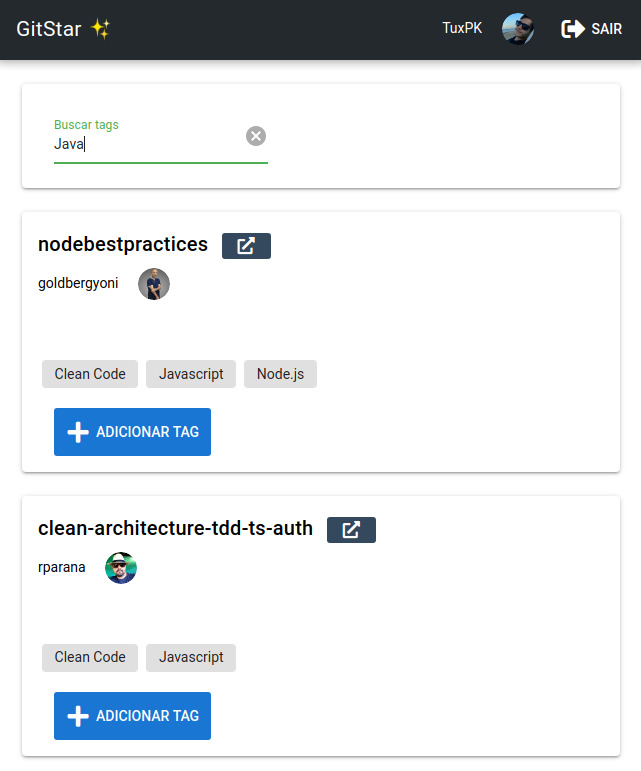

# Gitstars


Application to view starred projects and be able to search for tags that can be created and edited. All user starred repositories came from github API and only the tags will be saved in database with repository id to search and tag.

You can access the application page by [Gitstars](https://gitstar-five.vercel.app/)



## Front-end

The front-end application was made using [Quasar Framework](https://quasar.dev/), a framework based in Vue.js. Uou can find the repository application accessing this [Gitstars-frontend](https://github.com/TuxPK/Gitstars-frontend)

## Back-end

Back-end was made in node.js with express.

### Project dependecies

* axios
* eslint
* cors
* dotenv
* express
* jsonwebtoken
* pg pg-hstore
* sequelize sequelize -cli
* uuid
* nodemon
* sucrase
* jest
* sqlite3
* supertest

### You need to set a github oauth token

For this, go to github [developer settings](https://github.com/settings/apps) and create a oauth app.


### Set the enviroment variables at .env
```bash
  # GITHUB API ENV
  GITHUB_CLIENT_ID=*******************
  GITHUB_CLIENT_SECRET=************************************

  # DATABASE ENV
  DATABASE_HOST=localhost
  DATABASE_USER=postgres
  DATABASE_PASS=carbonara
  DATABASE_DATABASE=gitstar
```

### You can add a Database using docker:
```bash
docker run --name database -e POSTGRES_PASSWORD=carbonara -p 5432:5432 -d postgres
```

### To load the project install the dependencies
```bash
yarn 
  or 
npm install
```

### You need to run migrations to create the tables
```bash
yarn sequelize db:migrate
```

### To run test with jest:
```
yarn test
  or
npm test
```

### Start the server in development mode (hot-code reloading, error reporting, etc...)
```bash
yarn dev 
  or 
npm dev
```

### Lint the files
```bash
yarn run lint
  or
npm run lint
```

### Run server in production
```bash
npm build
npm start
  or 
yarn build
yarn start
```